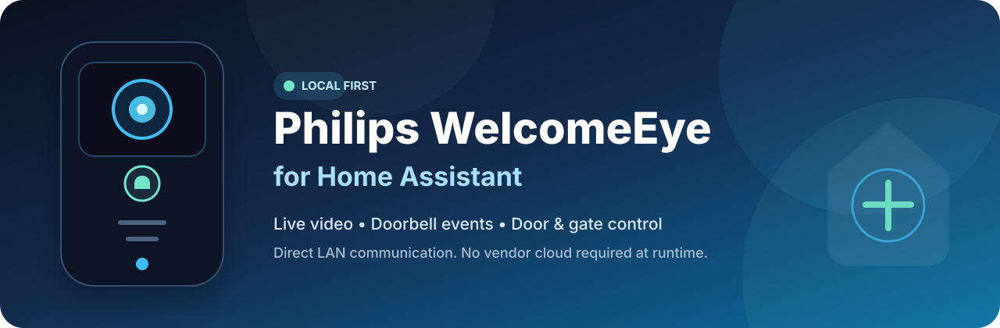

<p align="center">
  
</p>

<h1 align="center">Philips WelcomeEye for Home Assistant</h1>

<p align="center">
  <a href="https://www.home-assistant.io/"></a>
  <a href="https://github.com/Mins95/WelcomeEye/releases"></a>
  <a href="https://github.com/hacs/integration"></a>
  <a href="LICENSE"></a>
  <a href="https://github.com/Mins95/WelcomeEye/stargazers"></a>
  <a href="https://github.com/Mins95/WelcomeEye/releases"></a>
</p>

<p align="center">
  <a href="https://ko-fi.com/mins95"></a>
</p>

<p align="center">
  A local Home Assistant integration for <b>Philips WelcomeEye</b> video intercoms.<br>
  Live video, doorbell events and door/gate control — directly over your LAN, without the vendor cloud at runtime.
</p>

---

> [!WARNING]
> **Release candidate — active development.** Compatibility may vary by model and firmware. Please report hardware test results and issues on GitHub.

> [!NOTE]
> This project is community maintained and is not affiliated with, endorsed by, or supported by Philips, Avidsen, Home Assistant or HACS.

## ✨ Features

- **Local communication** — the intercom is contacted directly on your LAN.
- **Live H.264 video + G.711 audio** — exposed through Home Assistant Stream/HLS.
- **Doorbell detection** — supported locally on **WelcomeEye Connect 2**.
- **Door & gate control** — dedicated Home Assistant buttons.
- **On-demand media sessions** — the video session is opened only while required.
- **Passive snapshots** — the latest decoded frame can be exposed as a still image.
- **Privacy-safe diagnostics** — no password, UID, private IP, raw media, SDP or TURN credential export.
- **HACS-ready releases** — HACS downloads the dedicated `welcomeeye_local.zip` release asset.
- **No TURN server required for RC2** — remote Home Assistant viewing uses the Stream/HLS path validated on a restrictive enterprise Wi-Fi network.

---

## 📦 Supported devices

| Device | Video / audio | Door strike / gate | Doorbell | Status |
| --- | --- | --- | --- | --- |
| **WelcomeEye Connect 2** | ✅ Validated | ✅ Validated | ✅ Local detection | Main validated platform |
| **WelcomeEye Connect V1 / DES9900VDP** | ✅ Video validated on real hardware | 🧪 Software path validated; physical relay confirmation pending | ⏸️ Standby | Experimental / active testing |

Other WelcomeEye models and firmware variants should be considered experimental unless confirmed through testing.

---

## 🚀 Current release — `0.3.1-rc.2`

RC2 keeps the Home Assistant **Stream/HLS frontend transport** validated during real-world testing. On a restrictive enterprise Wi-Fi network, the older native WebRTC path received and decoded healthy H.264 but remained stuck in ICE `checking`. Switching the same camera to Home Assistant Stream/HLS made live video work on that network without TURN, an extra container, an external relay or a firewall change.

RC2 also improves release distribution: HACS now downloads the dedicated GitHub release asset **`welcomeeye_local.zip`**, so GitHub/HACS downloads can be counted correctly. The native WebRTC implementation remains in the codebase but is deliberately not advertised by the camera for this release candidate.

All device-side protocol behavior from the beta 8 stabilization baseline is retained, including Connect 2 behavior and the V1 `16/1/2` media profile, single-shot output safety, delayed TLV 506 handling, 5009 + 5005 teardown and bounded H.264 recovery.

See [CHANGELOG.md](CHANGELOG.md), [docs/README.md](docs/README.md) and the [beta 8 stabilization audit](docs/stabilization-beta8.md) for the technical history.

---

## 📥 Installation

### HACS — recommended

[](https://my.home-assistant.io/redirect/hacs_repository/?owner=Mins95&repository=WelcomeEye&category=integration)

1. Click the button above, or open **HACS → Integrations → ⋮ → Custom repositories**.
2. Add `https://github.com/Mins95/WelcomeEye` as **Integration**.
3. Search for **Philips WelcomeEye** and click **Download**.
4. Restart Home Assistant.
5. Go to **Settings → Devices & services → Add integration**.
6. Search for **Philips WelcomeEye**.

### Manual installation

1. Download the latest `welcomeeye_local.zip` from [Releases](https://github.com/Mins95/WelcomeEye/releases).
2. Extract it to:

   ```text
   config/custom_components/welcomeeye_local/
   ```

3. Restart Home Assistant.
4. Add the integration from **Settings → Devices & services**.

> [!TIP]
> HACS is recommended because it provides update notifications and handles future upgrades automatically.

---

## ➕ Setup

[](https://my.home-assistant.io/redirect/config_flow_start/?domain=welcomeeye_local)

The setup form asks for:

- the intercom **IPv4 address**;
- the username, normally `admin`;
- the **local unlock code used to open the gate/door from the WelcomeEye app**.

> [!IMPORTANT]
> The requested password/code is **not your Philips/WelcomeEye cloud account password**. Use the **local door/gate unlock code** configured for the intercom.

A DHCP reservation or static lease is recommended so the intercom keeps the same IPv4 address.

---

## 🎮 Home Assistant entities

Depending on the device model and current validation status, the integration exposes:

| Entity | Purpose |
| --- | --- |
| **Camera** | Live WelcomeEye video through Home Assistant Stream/HLS |
| **Sonnette** | Local ring state on supported Connect 2 hardware |
| **Open output 1** | Door strike command |
| **Open output 2** | Gate command |
| **Session vidéo** | Diagnostic connectivity/session state |

Output commands are **single-shot**: once a physical TLV 505 may have been sent, the integration never automatically retries that action.

---

## 🔔 Doorbell and output controls

### WelcomeEye Connect 2

Local doorbell detection, door strike control and gate control are validated and keep the existing protocol behavior unchanged.

### WelcomeEye Connect V1 / DES9900VDP

The V1 uses a different legacy LT protocol. Live video is validated on real hardware using the vendor-app profile **channel 16 / stream 1 / mode 2**.

Door/gate commands are routed through that active media session and remain strictly single-shot. The software path is validated, but **physical relay actuation still needs confirmation on real V1 hardware**.

The V1 doorbell entity remains unavailable while a reliable local event path is unresolved. The integration does not introduce vendor-cloud runtime communication as a workaround.

For detailed V1 framing, H.264 recovery, Stop AV/session-stop behavior and validation notes, see [docs/README.md](docs/README.md).

---

## 🌐 Video transport

RC2 exposes the camera through Home Assistant's **Stream/HLS** path using the integration's existing local MPEG-TS source.

This design was selected after field testing showed that native WebRTC could remain blocked by restrictive network ICE/firewall policies even while WelcomeEye media itself was healthy. Stream/HLS uses the normal Home Assistant HTTP path and proved more compatible in that environment.

The internal MPEG-TS proxy remains bound to `127.0.0.1` with a random path. It is consumed by Home Assistant and is not exposed as a raw LAN service.

Initial playback may take a few seconds to buffer before stabilizing, and latency can be higher than native WebRTC.

---

## ⚠️ Known limitations

- This is a **release candidate under active development**.
- Stream/HLS startup may need a few seconds before playback stabilizes.
- Native WelcomeEye WebRTC code is retained but intentionally not advertised in RC2.
- WelcomeEye Connect V1 doorbell detection is currently disabled / on standby.
- V1 door-strike and gate control still need **physical relay validation on real hardware**.
- A TLV 506 `result=1` acknowledgement confirms the protocol reply only; it is not treated as proof that a physical relay moved.
- V1 busy-state clearance after session teardown still requires real-hardware validation.
- V1 fragmented-video reassembly for TLVs 103/106/107/108 is not implemented yet.
- Microphone / two-way audio is **not validated** on hardware.
- A snapshot does not wake the camera on its own; no still may exist until a live stream has produced a frame.
- The integration accepts an **IPv4 address**, not a hostname.
- Home Assistant must be able to reach the intercom directly on the LAN.
- Discovery uses UDP port `1500`, followed by the TCP port advertised by the device.

---

## 🔐 Security & privacy

Diagnostics deliberately omit credentials, device UID, private device IP, raw media payloads, alarm payloads, FCM tokens, SDP, ICE candidate values, ICE server URLs, TURN credentials and internal stream URLs.

The integration communicates with the intercom locally and does **not** use the Philips/WelcomeEye vendor cloud API at runtime.

Please do not post passwords, device identifiers, private IP addresses, cloud notification identifiers, packet captures or raw media/alarm payloads in public GitHub issues.

See [SECURITY.md](SECURITY.md) for more information.

---

## 🧪 Development & validation

The repository includes GitHub Actions for:

- the full pytest suite;
- Python 3.12 / 3.14 validation;
- HACS repository validation;
- Home Assistant Hassfest validation.

Beta 8 completed the major lifecycle/H.264/V1 stabilization pass with **135 tests plus 3 subtests**. RC1/RC2 add focused transport, release-distribution and version-alignment checks without changing the validated Connect 2 protocol behavior.

Useful technical references:

- [Current technical notes](docs/README.md)
- [Beta 8 stabilization audit](docs/stabilization-beta8.md)
- [V1 media/control stability](docs/v1-stability-beta7.md)
- [V1 output-control investigation](docs/v1-control-events-beta5.md)
- [V1 doorbell investigation](docs/v1-doorbell-beta6.md)
- [Changelog](CHANGELOG.md)

---

## 🤝 Contributing

Hardware feedback is especially useful. If you have another WelcomeEye model or firmware revision, please open an [issue](https://github.com/Mins95/WelcomeEye/issues) with the model, Home Assistant version and privacy-safe diagnostics.

If the integration is useful to you, a ⭐ on the repository helps other Home Assistant users discover the project.

<p align="center">
  <a href="https://ko-fi.com/mins95"></a>
</p>

---

## 📜 License

Distributed under the [MIT License](LICENSE).
