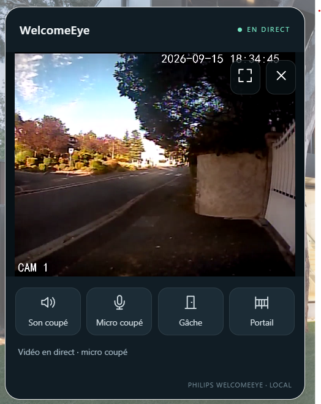

# Interphone 0.4.0-beta.1 : protocole, validation et installation

Bêta issue de `origin/main` à `910a89529c9de242f5287315d361894a0dcdb084` (0.3.1-rc.2), branche `feature-intercom-player`. Le propriétaire a confirmé le fonctionnement physique du microphone sur Connect 2 le 15 septembre 2026. La validation du microphone V1 reste à effectuer.

## Résultat livré

La carte **WelcomeEye — Interphone** réunit la vidéo WebRTC, le son descendant, le microphone activable/désactivable, la gâche et le portail. Les deux commandes utilisent les boutons HA existants et leurs permissions. Aucune commande d'ouverture ne transite dans le canal microphone.

La caméra standard conserve Stream/HLS. La carte fournie ajoute les commandes dans son propre lecteur : elle ne modifie pas le dialogue caméra intégré à Home Assistant. Elle utilise les serveurs ICE configurés par HA ; un réseau bloquant WebRTC peut nécessiter TURN. HLS ne transporte pas le microphone.

## Preuves APK / natives

Analyse statique de l'extraction existante de WelcomeEye 6.1.58.24. Aucun nouveau protocole n'a été inventé pour remplacer une information manquante.

Chemins relatifs dans le workspace d'analyse : sources Java dans `work/decompiled/sources`, bibliothèques dans `work/talkback_native`. L'APK et ses extractions ne sont pas distribués dans ce dépôt.
Les adresses ci-dessous sont les adresses virtuelles ELF ARM32/Thumb, pas les offsets du fichier.

| Emplacement | Observation |
|---|---|
| `com/quvii/compathlt/QvLtPlayerCore.java`, autour de 623, 646 | Métadonnées LT canal logique + 15, stream 1, mode 2 ; `startTalking()` utilise le `liveChannel` existant. |
| même classe, autour de 375 et 435 | Réponse positive : configure le format voix puis démarre l'enregistrement ; callback envoie `liveChannel.sendAudioData(0, bArr)`. |
| `glnk/client/GlnkChannel.java` | `startTalking` appelle `sendTalkCmd(1)`, `stopTalking` appelle `sendTalkCmd(2)`. |
| `com/quvii/qvplayer/audio/AudioPlayerManager.java` | AudioRecord PCM16, mono, 8 kHz ; tampon minimum de 640 octets. La taille peut augmenter selon Android. |
| `libglnkio.so`, `sendTalkCmd`, `0x8ed04–0x8ed5c` | Corps de huit octets, commande à l'offset 4, TLV 331. |
| `libglnkio.so`, `sendData2`, `0x8902c–0x89150` | OWSP interne complet ; en mode protégé, enveloppe privée 509. |
| `libglnkio.so`, branche 332 de `onParse`, `0x91392–0x913e8` | Résultat, taux, format, canaux et bits lus aux offsets détaillés ci-dessous. |
| `libglnkio.so`, `sendAudioData`, `0x8ed5c–0x8ee30` | Même DataChannel ; OWSP séquence 0, TLV 97 puis 98 ; canal natif + 1 et timestamp fourni par Java. |
| `libglnkio.so`, `getChannelNO`, `0x88ba2`, et `setParams`, `0x88778–0x8899c` | Le canal configuré est stocké directement ; canal 16 donne métadonnée 17. |
| `liblive_player.so`, JNI `sendVoiceDataCompat`, `0x2f1dd4–0x2f1ed0` | Entrée PCM vers `OnAudioDataCompat`, puis encodeur. |
| `liblive_player.so`, `OnAudioCaptureCompat`, `0x2f90d0–0x2f9298` | Format interne 4 vers PCMA, 5 vers PCMU. |
| `liblive_player.so`, `voiceDataCallBack`, `0x2f18c6–0x2f193e` | `FrameGetData` et `FrameGetLength` : callback Java contenant les octets encodés, sans l'en-tête interne CPacket. |
| `QvLtPlayerCore.java`, 919–929 et 976 ; `LtVariates.java` | Attend deux secondes depuis le dernier stop avant start. La constante ExoPlayer référencée vaut 2000 ms. |

La chaîne observée est AudioRecord → PCM16 → encodeur natif G.711 → callback Java → GlnkChannel → DataChannel → socket de la vidéo active. Les classes TCRequestBean/AlarmHelper concernent d'autres commandes et alarmes ; elles ne constituent pas la preuve du transport micro.

## Protocole implémenté

1. `start_talk()` envoie un OWSP contenant 331, corps `00 00 00 00 01 00 00 00`, encapsulé par le constructeur privé 509 existant. Il ne crée aucune session vidéo supplémentaire.
2. Attend au plus quatre secondes la réponse 332, directe ou extraite de 510 après déchiffrement de l'OWSP interne.
3. Corps 332 d'au moins 20 octets, little endian : résultat u16 à 0 (succès 1), sample rate u32 à 4, format u16 à 12, canaux u16 à 14, bits u16 à 18.
4. Formats acceptés : 31257 = G.711 A-law, 31269 = G.711 mu-law ; 8000 Hz, mono, PCM source 16 bits. 31270 et les autres variantes sont rejetés, sans estimation du codec.
5. Audio entrant du navigateur via aiortc → PyAV PCM16 mono 8 kHz → blocs de 320 échantillons → encodeur A-law/mu-law. Chaque bloc donne 320 octets pour 40 ms. Cette taille correspond au minimum de 640 octets PCM observé dans l'app, sans prétendre que toutes les versions Android utilisent uniquement cette taille.
6. Chaque bloc : OWSP séquence 0 ; TLV 97, corps `<B3xI` = canal natif + 1, trois octets réservés nuls, timestamp 0 ; TLV 98 contenant seulement les données G.711. Pas d'enveloppe chiffrée supplémentaire sur ces frames, conformément au chemin natif identifié.
7. `stop_talk()` ferme immédiatement la permission d'émettre, puis envoie 331 avec commande 2 sur la même session. L'arrêt est idempotent. Un paquet dont l'écriture était déjà engagée ne peut pas être rappelé.

Le lecteur attend l'accord natif avant d'activer la piste locale. Un seul spectateur peut posséder le micro. La fermeture, une autorisation tardive après annulation, la perte du canal de contrôle et la perte de session interrompent l'émission. Un heartbeat par seconde borne la persistance en cas de disparition silencieuse du client ; expiration après trois secondes, vérification chaque seconde. La vidéo n'est pas arrêtée par une simple coupure du micro. Au démontage média, stop-talk précède le nettoyage AV existant.

## Connexion V1 : ce qui est démontré

Le diagnostic du testeur montre un dernier échec **discovery**, avec aucune lecture de login, et une ouverture échouée à l'acquisition média avec **zéro tentative 505**. Il ne démontre pas une absence de 502 pendant vingt secondes. Les compteurs H264/Start AV attestent une session antérieure réussie avec le profil 16/1/2.

Bug reproduit dans la base : un endpoint reste en cache après timeout TCP, timeout login, EOF/reset avant authentification ou second refus TCP. La candidate invalide uniquement l'observation concernée. L'acquisition suivante redécouvre ; aucun retry général n'est ajouté. Le seul nouvel essai dans `connect()` reste le second TCP déjà prévu par la base après le premier ConnectionRefusedError.

Autre défaut reproduit : une suite de padding ou un en-tête fragmenté pouvait garder `read()` au-delà de la deadline login. Cette limite est maintenant vérifiée dans le lecteur pré-authentification ; les fragments survivent aux timeouts intermédiaires.

Différence APK corrigée : l'attente de deux secondes entre stop et nouvelle acquisition V1. Cela rapproche le cycle logiciel de l'app, mais ne prouve pas que cette différence causait les pertes UDP du testeur.

Une discovery silencieuse dure environ six secondes hors attente du verrou ; TCP peut attendre cinq secondes ; l'attente login nominale est vingt secondes. L'interface peut aussi attendre acquisition et nettoyage. Les nouveaux compteurs séparent ces phases. Perte UDP, firmware occupé, contention et endpoint réellement changé restent des hypothèses sans nouvelle mesure matérielle.

La fermeture V1 conserve 5009 → 5005 → TCP close. Une fermeture normale conserve le cache. Une défaillance après authentification ne déclenche pas la nouvelle invalidation pré-authentification. Le backoff média existant reste inchangé ; si un autre consommateur conserve un worker en échec, une nouvelle acquisition peut encore rencontrer son erreur précédente pendant le backoff.

## Invariant d'ouverture

Un clic explicite appelle une seule fois `button.press`. Le verrou frontend bloque le double clic pendant la requête. Le service HA conserve le verrou non bloquant et le délai existant entre commandes.

V1 : `execute` attend d'abord `hub.acquire`, crée un seul PendingOutput lié à la Session exacte ; `send_pending` ne traite que l'état `queued`, le transforme en `sent`, marque `send_attempted=True` et efface le paquet stocké **avant** l'unique `send_packet`. Toute erreur ferme ce chemin ; aucun retour à `queued`, aucune migration sur une nouvelle Session. Une confirmation incertaine interdit une autre action sur cette session jusqu'à sa fermeture. La réponse 506 n'engendre aucun envoi.

Connect 2 : le constructeur 505 est suivi d'un seul `send_packet`, puis attente de 506 ; le repli de connexion existant se trouve uniquement avant la construction/envoi de 505. Il n'y a aucun retry après envoi tenté. Le talkback utilise exclusivement 331/97/98 et ne peut déclencher `unlock`.

`send_packet` ajoute un verrou d'écriture commun, pas une boucle d'envoi applicative. Les constructeurs de 505/506/5009/5005, l'encodage du mot de passe, les nonces, le chiffrement et le mapping des sorties ne sont pas modifiés. Une tentative peut échouer après un envoi partiel ; elle reste comptée comme tentative unique, jamais rejouée.

## Diagnostics

`media.connection` / `transport_framing` : étapes discovery, TCP, envoi login, attente/réception 502, authentification ; durées de chaque phase ; source cache/fresh_discovery ; invalidation et motif ; deux essais maximum dans l'historique de connexion.

`media.acquisition` : acquisition obtenue, worker réutilisé, durée d'attente, durée du nettoyage et stage d'échec. `lifecycle.reopen_wait_ms` : délai V1 appliqué. `media.microphone` : état, codec négocié, format, compteurs d'octets/frames, type d'erreur, `physically_verified=false`.

Aucune IP, UID, credential, code d'ouverture, donnée média, payload brut, SDP, valeur ICE ou URL interne ajoutée aux diagnostics. Les SDP transitent uniquement dans la signalisation WebRTC authentifiée, comme requis par WebRTC.

## Installation et test sur place

1. Dans HACS, ouvrir Philips WelcomeEye et sélectionner **0.4.0-beta.1** parmi les préversions proposées au téléchargement. Pour une installation manuelle, sauvegarder `config/custom_components/welcomeeye_local` et extraire le contenu du [ZIP de la bêta](https://github.com/Mins95/WelcomeEye/releases/download/v0.4.0-beta.1/welcomeeye_local.zip) dans ce dossier. Redémarrer HA. La configuration existante est conservée.
2. Recharger complètement l'interface de l'application Companion. Ajouter la carte **WelcomeEye — Interphone**, choisir la caméra. La ressource est enregistrée automatiquement ; aucune carte tierce à installer.
3. Ouvrir la vidéo, vérifier image et son descendant. Activer le micro, autoriser son accès, parler et confirmer à proximité de la platine que la voix est audible.
4. Couper le micro : émission interrompue, vidéo toujours ouverte. Fermer la vidéo : micro arrêté ; après libération, vérifier que l'app officielle peut reprendre sans busy persistant.
5. Télécharger le diagnostic pour confirmer version, codec/frames micro et phases de connexion. Aucun essai automatique de gâche ou portail n'est demandé par ce protocole de validation audio.

Dans Companion, le contexte WebView doit permettre `getUserMedia` : une simple adresse HTTP peut le bloquer. La carte explique le blocage et n'active rien silencieusement.

**Microphone Connect 2 : fonctionnement physique confirmé par le propriétaire le 15 septembre 2026.** L'image du Connect 2 a également été observée dans la nouvelle carte lors de deux ouvertures. Le microphone V1, la reprise par l'application officielle et les sorties V1 restent à valider sur place. La sonnette V1 reste en standby ; celle du Connect 2 conserve le chemin existant. Le champ logiciel `physically_verified=false` n'est pas modifié par ce retour terrain : il ne mesure pas l'audibilité à distance.

Configuration de la carte utilisée sur Connect 2 :

```yaml
type: custom:welcomeeye-card
entity: camera.welcomeeye_connect_2
```



La capture montre le microphone coupé au moment de l'image ; la confirmation de fonctionnement provient du test audio rapporté par le propriétaire.

## Validation logicielle

Tests conservés dans le workspace séparé `work/intercom-validation/tests` : client/session/worker réels sur sockets simulées, chiffrement réel, encodage/décodage PyAV, formats acceptés/refusés, arrêt/annulation, cycle V1, authentification et sécurité 505. Un test relie deux vrais pairs aiortc sur loopback, transmet le micro par SRTP et DataChannel, confirme les paquets natifs simulés, puis reçoit encore vidéo et audio descendants après coupure micro. Un test Edge à 480 et 360 px vérifie les interactions de la carte, les permissions tardives et les services simulés. Aucun visiophone n'est contacté par ces tests.

Résultats : suite complète de 169 tests + 3 sous-tests passée ; scénario supplémentaire d'ouverture V1 simulée pendant le microphone passé avec le groupe audio de 11 tests. Huit scénarios frontend Edge passés. Le stress de 50 acquisitions V1 inclut désormais le délai de deux secondes. Les primitives physiques ne sont exercées que sur les sockets simulées.

Imports de la candidate et tests des permissions/configuration/signalisation effectués séparément dans un conteneur HA existant : Python 3.14.6, aiortc 1.15.0, PyAV 17.0.1, succès. Ce contrôle d'API ne remplace pas le test audio sur place.

Références HA vérifiées : [signalisation caméra 2026.9.2](https://github.com/home-assistant/core/blob/2026.9.2/homeassistant/components/camera/webrtc.py), [WebSocket ActiveConnection](https://github.com/home-assistant/core/blob/2026.9.2/homeassistant/components/websocket_api/connection.py).
