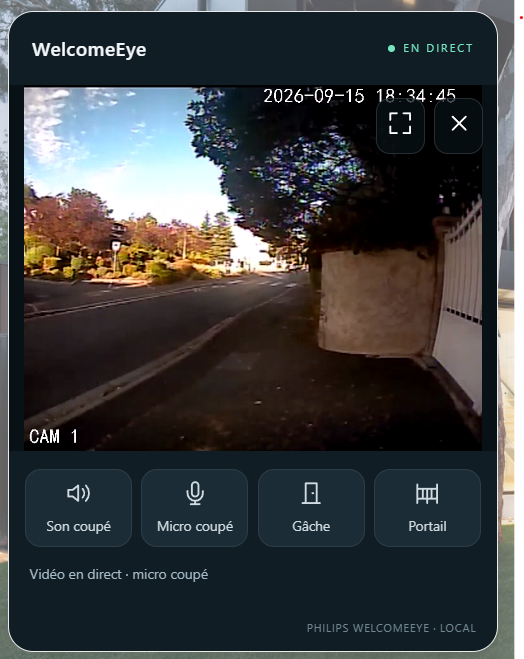

# Interphone : guide 0.4.3

**Version stable : 0.4.3.** Vidéo, son, microphone, gâche et portail sont validés physiquement sur Connect 2 R001 et Connect V1 / DES9900VDP. Sur Connect 3, vidéo, son, gâche et portail sont validés ; le microphone est disponible, avec confirmation physique encore attendue dans le retour de test. La sonnette du Connect 2 R001 est locale ; celle du V1 via le cloud est validée et facultative. La sonnette Connect 3 reste en recherche.

## Installer la carte

1. Installer **0.4.3** dans HACS et redémarrer Home Assistant en conservant l'entrée existante.
2. La ressource de la carte est ajoutée et mise à jour automatiquement lorsque HA la gère dans l'interface. Recharger complètement le navigateur ou l'application Companion. Pour les ressources YAML, utiliser le repli manuel ci-dessous.
3. Ajouter la carte **WelcomeEye — Interphone** et choisir la caméra. Son JavaScript est fourni avec l'intégration.

```yaml
resources:
  - url: /welcomeeye_local/welcomeeye-card.js?v=0.4.3
    type: module
```

```yaml
type: custom:welcomeeye-card
entity: camera.welcomeeye_connect_2
```

## Utiliser l'interphone et les photos

La carte affiche les commandes prises en charge par l'appareil : son, microphone, gâche, portail et Photo. Sur Connect 2 R001 et V1, les cinq boutons restent sur une seule ligne compacte, même sur une carte étroite. Les commandes de gâche et portail utilisent les boutons HA et leurs permissions. Chaque clic lance au plus une tentative ; une reconnexion ne rejoue pas la commande.

Pour le microphone, ouvrir HA en **HTTPS avec un certificat reconnu**, puis autoriser son accès. Une URL HTTP locale bloque le micro, y compris dans Companion ; vérifier l'URL utilisée sur le Wi-Fi domestique. La fermeture de la carte, le passage en arrière-plan et la perte de connexion coupent le microphone. Une reconnexion demande une nouvelle activation explicite. Le repli HLS permet la vidéo et le son, sans microphone.

**Photo** prend une image fraîche du flux local, avec la vidéo ouverte ou fermée, et tente de la sauvegarder dans **Médias → WelcomeEye**. Elle met à jour **Dernière capture** sans remplacer **Dernière sonnerie**. « Photo enregistrée » apparaît uniquement après confirmation de sauvegarde. Voir [captures, service et stockage](captures.md).

**Capture sur sonnerie** est un switch HA séparé, disponible sur Connect 2 R001 et sur V1 après activation du [cloud facultatif](v1-cloud-doorbell.md). Il est **ON par défaut**, sauf préférence OFF déjà enregistrée. Chaque sonnerie reconnue prévoit une capture à partir de **T+4 secondes** ; sur V1, ce délai part de l'acceptation de l'événement par HA.

**Limite connue :** cette acquisition peut couper l'appel du moniteur et la sonnerie de la platine extérieure environ **cinq secondes après l'appui**. Les notifications et la sonnerie de l'application Philips sur smartphone continuent. Passer **Capture sur sonnerie à OFF** évite les photos automatiques ; les lecteurs vidéo et les vignettes caméra peuvent encore prendre le média. L'image HA est sa propre capture fraîche, pas la photo stockée par le moniteur.



Cette image historique montre le microphone coupé ; la validation audio repose sur les essais physiques.

## Historique du protocole interphone

Les preuves ci-dessous conservent l'analyse de la branche initiale `feature-intercom-player` et les corrections OWSP intégrées aux versions 0.4.x pour Connect 2 R001 et V1. Les diagnostics et hypothèses décrivent ces essais historiques. Le statut courant est celui indiqué en tête de ce guide. Les résultats logiciels de cette période sont archivés dans l'[audit beta.4](audit-beta4.md).

<details>
<summary>Preuves APK, protocole OWSP et diagnostics historiques</summary>

## Preuves APK / natives

Analyse statique de l'extraction existante de WelcomeEye 6.1.58.24. Aucun nouveau protocole n'a été inventé pour remplacer une information manquante.

Chemins relatifs dans le workspace d'analyse : sources Java dans `work/decompiled/sources`, bibliothèques dans `work/talkback_native`. L'APK et ses extractions ne sont pas distribués dans ce dépôt.
Les adresses ci-dessous sont les adresses virtuelles ELF ARM32/Thumb, pas les offsets du fichier.

| Emplacement | Observation |
|---|---|
| `com/quvii/compathlt/QvLtPlayerCore.java`, autour de 623, 646 | Métadonnées LT canal logique + 15, stream 1, mode 2 ; `startTalking()` utilise le `liveChannel` existant. |
| même classe, autour de 375 et 435 | Réponse positive : configure le format voix puis démarre l'enregistrement ; callback envoie `liveChannel.sendAudioData(0, bArr)`. |
| `glnk/client/GlnkChannel.java` | `startTalking` appelle `sendTalkCmd(1)`, `stopTalking` appelle `sendTalkCmd(2)`. |
| `com/quvii/qvplayer/audio/AudioPlayerManager.java` | AudioRecord PCM16, mono, 8 kHz ; tampon minimum de 640 octets. La taille peut augmenter selon Android. |
| `libglnkio.so`, `sendTalkCmd`, `0x8ed04–0x8ed5c` | Corps de huit octets, commande à l'offset 4, TLV 331. |
| `libglnkio.so`, `sendData2`, `0x8902c–0x89150` | OWSP interne complet ; en mode protégé, enveloppe privée 509. |
| `libglnkio.so`, branche 332 de `onParse`, `0x91392–0x913e8` | Résultat, taux, format, canaux et bits lus aux offsets détaillés ci-dessous. |
| `libglnkio.so`, `sendAudioData`, `0x8ed5c–0x8ee30` | Même DataChannel ; OWSP séquence 0, TLV 97 puis 98 ; canal natif + 1 et timestamp fourni par Java. |
| `libglnkio.so`, `getChannelNO`, `0x88ba2`, et `setParams`, `0x88778–0x8899c` | Le canal configuré est stocké directement ; canal 16 donne métadonnée 17. |
| `liblive_player.so`, JNI `sendVoiceDataCompat`, `0x2f1dd4–0x2f1ed0` | Entrée PCM vers `OnAudioDataCompat`, puis encodeur. |
| `liblive_player.so`, `OnAudioCaptureCompat`, `0x2f90d0–0x2f9298` | Format interne 4 vers PCMA, 5 vers PCMU. |
| `liblive_player.so`, `voiceDataCallBack`, `0x2f18c6–0x2f193e` | `FrameGetData` et `FrameGetLength` : callback Java contenant les octets encodés, sans l'en-tête interne CPacket. |
| `QvLtPlayerCore.java`, 919–929 et 976 ; `LtVariates.java` | Attend deux secondes depuis le dernier stop avant start. La constante ExoPlayer référencée vaut 2000 ms. |

La chaîne observée est AudioRecord → PCM16 → encodeur natif G.711 → callback Java → GlnkChannel → DataChannel → socket de la vidéo active. Les classes TCRequestBean/AlarmHelper concernent d'autres commandes et alarmes ; elles ne constituent pas la preuve du transport micro.

## Protocole implémenté

1. `start_talk()` envoie un OWSP contenant 331, corps `00 00 00 00 01 00 00 00`, encapsulé par le constructeur privé 509 existant. Il ne crée aucune session vidéo supplémentaire.
2. Attend au plus quatre secondes la réponse 332, directe ou extraite de 510 après déchiffrement de l'OWSP interne.
3. Corps 332 d'au moins 20 octets, little endian : résultat u16 à 0 (succès 1), sample rate u32 à 4, format u16 à 12, canaux u16 à 14, bits u16 à 18.
4. Formats acceptés : 31257 = G.711 A-law, 31269 = G.711 mu-law ; 8000 Hz, mono, PCM source 16 bits. 31270 et les autres variantes sont rejetés, sans estimation du codec.
5. Audio entrant du navigateur via aiortc → PyAV PCM16 mono 8 kHz → blocs de 320 échantillons → encodeur A-law/mu-law. Chaque bloc donne 320 octets pour 40 ms. Cette taille correspond au minimum de 640 octets PCM observé dans l'app, sans prétendre que toutes les versions Android utilisent uniquement cette taille.
6. Chaque bloc : OWSP séquence 0 ; TLV 97, corps `<B3xI` = canal natif + 1, trois octets réservés nuls, timestamp 0 ; TLV 98 contenant seulement les données G.711. Pas d'enveloppe chiffrée supplémentaire sur ces frames, conformément au chemin natif identifié.
7. `stop_talk()` ferme immédiatement la permission d'émettre, puis envoie 331 avec commande 2 sur la même session. L'arrêt est idempotent. Un paquet dont l'écriture était déjà engagée ne peut pas être rappelé.

Le lecteur attend l'accord natif avant d'activer la piste locale. Un seul spectateur peut posséder le micro. La fermeture, une autorisation tardive après annulation, la perte du canal de contrôle et la perte de session interrompent l'émission. Un heartbeat par seconde borne la persistance en cas de disparition silencieuse du client ; expiration après trois secondes, vérification chaque seconde. La vidéo n'est pas arrêtée par une simple coupure du micro. Au démontage média, stop-talk précède le nettoyage AV existant.

## Connexion V1 : ce qui est démontré

Le diagnostic du testeur montre un dernier échec **discovery**, avec aucune lecture de login, et une ouverture échouée à l'acquisition média avec **zéro tentative 505**. Il ne démontre pas une absence de 502 pendant vingt secondes. Les compteurs H264/Start AV attestent une session antérieure réussie avec le profil 16/1/2.

Bug reproduit dans la base : un endpoint reste en cache après timeout TCP, timeout login, EOF/reset avant authentification ou second refus TCP. La candidate invalide uniquement l'observation concernée. L'acquisition suivante redécouvre ; aucun retry général n'est ajouté. Le seul nouvel essai dans `connect()` reste le second TCP déjà prévu par la base après le premier ConnectionRefusedError.

Autre défaut reproduit : une suite de padding ou un en-tête fragmenté pouvait garder `read()` au-delà de la deadline login. Cette limite est maintenant vérifiée dans le lecteur pré-authentification ; les fragments survivent aux timeouts intermédiaires.

Différence APK corrigée : l'attente de deux secondes entre stop et nouvelle acquisition V1. Cela rapproche le cycle logiciel de l'app, mais ne prouve pas que cette différence causait les pertes UDP du testeur.

Une discovery silencieuse dure environ six secondes hors attente du verrou ; TCP peut attendre cinq secondes ; l'attente login nominale est vingt secondes. L'interface peut aussi attendre acquisition et nettoyage. Les nouveaux compteurs séparent ces phases. Perte UDP, firmware occupé, contention et endpoint réellement changé restent des hypothèses sans nouvelle mesure matérielle.

La fermeture V1 conserve 5009 → 5005 → TCP close. Une fermeture normale conserve le cache. Une défaillance après authentification ne déclenche pas la nouvelle invalidation pré-authentification. Le backoff média existant reste inchangé ; si un autre consommateur conserve un worker en échec, une nouvelle acquisition peut encore rencontrer son erreur précédente pendant le backoff.

## Invariant d'ouverture

Un clic explicite appelle une seule fois `button.press`. Le verrou frontend bloque le double clic pendant la requête. Le service HA conserve le verrou non bloquant et le délai existant entre commandes.

V1 : `execute` attend d'abord `hub.acquire`, crée un seul PendingOutput lié à la Session exacte ; `send_pending` ne traite que l'état `queued`, le transforme en `sent`, marque `send_attempted=True` et efface le paquet stocké **avant** l'unique `send_packet`. Toute erreur ferme ce chemin ; aucun retour à `queued`, aucune migration sur une nouvelle Session. Une confirmation incertaine interdit une autre action sur cette session jusqu'à sa fermeture. La réponse 506 n'engendre aucun envoi.

Connect 2 : le constructeur 505 est suivi d'un seul `send_packet`, puis attente de 506 ; le repli de connexion existant se trouve uniquement avant la construction/envoi de 505. Il n'y a aucun retry après envoi tenté. Le talkback utilise exclusivement 331/97/98 et ne peut déclencher `unlock`.

`send_packet` ajoute un verrou d'écriture commun, pas une boucle d'envoi applicative. Les constructeurs de 505/506/5009/5005, l'encodage du mot de passe, les nonces, le chiffrement et le mapping des sorties ne sont pas modifiés. Une tentative peut échouer après un envoi partiel ; elle reste comptée comme tentative unique, jamais rejouée.

## Diagnostics

`media.connection` / `transport_framing` : étapes discovery, TCP, envoi login, attente/réception 502, authentification ; durées de chaque phase ; source cache/fresh_discovery ; invalidation et motif ; deux essais maximum dans l'historique de connexion.

`media.acquisition` : acquisition obtenue, worker réutilisé, durée d'attente, durée du nettoyage et stage d'échec. `lifecycle.reopen_wait_ms` : délai V1 appliqué. `media.microphone` : état, codec négocié, format, compteurs d'octets/frames, type d'erreur. Le champ logiciel `physically_verified=false` n’est pas utilisé comme source de vérité pour l’audibilité réelle ; celle-ci est documentée séparément à partir des essais matériels.

Aucune IP, UID, credential, code d'ouverture, donnée média, payload brut, SDP, valeur ICE ou URL interne ajoutée aux diagnostics. Les SDP transitent uniquement dans la signalisation WebRTC authentifiée, comme requis par WebRTC.

</details>
